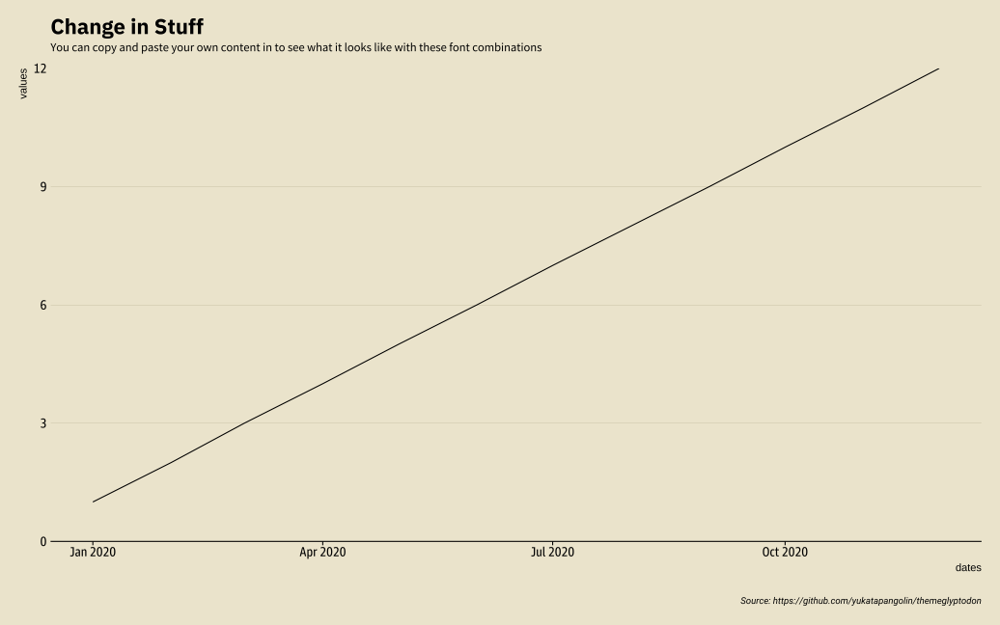

<!-- README.md is generated from README.Rmd. Please edit that file -->
# theme\_glyptodon

<!-- badges: start -->
[](https://github.com/yukatapangolin/themeglyptodon/actions) <!-- badges: end -->

Theme for ggplot2 based on hrbthemes

## Installation

You can install the package with:

``` r
# install.packages("devtools")
devtools::install_github("yukatapangolin/themeglyptodon")
```

## Example

``` r
library(glyptodon)
library(ggplot2)
library(showtext)
#> Loading required package: sysfonts
#> Loading required package: showtextdb

font_add_google("Arimo", "Arial")
font_add("Roboto Condensed", 
                file.path(system.file("fonts", 
                                      "roboto-condensed", 
                                      package="glyptodon"),
                          "RobotoCondensed-Regular.ttf"))
font_add("Roboto Condensed Light", 
                file.path(system.file("fonts", 
                                      "roboto-condensed", 
                                      package="glyptodon"),
                          "RobotoCondensed-Light.ttf"))
font_add("Goldman Sans Condensed",
         file.path(system.file("fonts", 
                               "goldman-sans", 
                               package="glyptodon"),
                   "GoldmanSansCd_Rg.ttf"))
showtext_auto()
## basic example code
df <- data.frame(dates = seq(as.Date("2020-01-01"), length.out = 12, 
                                     by = "month"),
                 values = 1:12)
ggplot(df, aes(dates, values)) +
  geom_line()+
  theme_glyptodon() +
  labs(title = "Example",
       subtitle = "Testing",
       caption = "Source: https://github.com/yukatapangolin/themeglyptodon")
```


